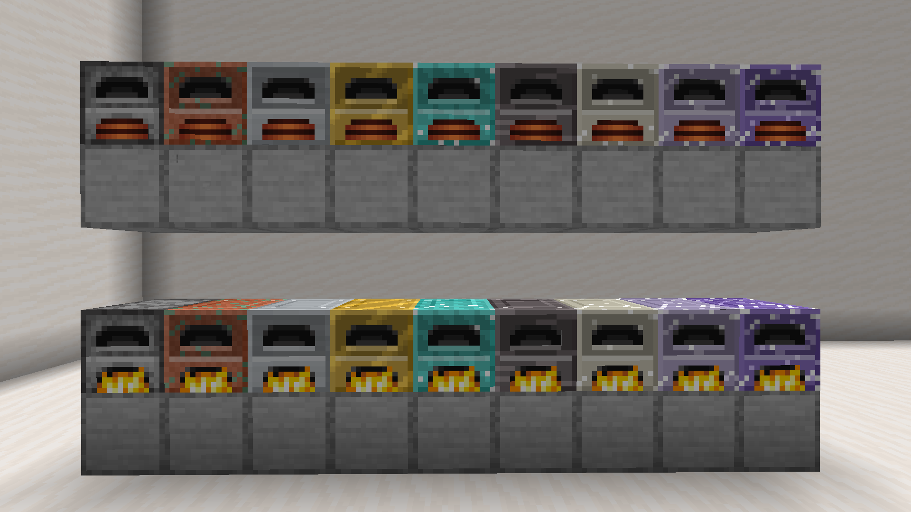

# Caminus

English | [日本語](README.ja.md)

Furnaces in eight tiers. Each tier smelts faster and more items at once.

*Caminus* is Latin for a furnace.

## Screenshots



More in [branding/gallery](branding/gallery).

## Target

| | |
|---|---|
| Minecraft | 1.21.1 |
| Loader | NeoForge 21.1.248 |
| Java | 21 |

## Tiers

| Tier | Material | Ticks per smelt | Items per smelt | Slots | Items per second |
|---|---|---|---|---|---|
| — | Vanilla furnace | 200 | 1 | 1 | 0.1 |
| 1 | Copper | 83 | 1 | 1 | 0.24 |
| 2 | Iron | 34 | 1 | 1 | 0.59 |
| 3 | Gold | 14 | 1 | 1 | 1.4 |
| 4 | Diamond | 6 | 4 | 1 | 13 |
| 5 | Netherite | 2 | 16 | 1 | 160 |
| 6 | Nether Star | 1 | 64 | 1 | 1,280 |
| 7 | Compressed Nether Star | 1 | 128 | 4 | 10,240 |
| 8 | Super Compressed Nether Star | 1 | 256 | 16 | 81,920 |

Ticks per smelt are for a recipe that takes 200 ticks in a vanilla furnace. Other recipes
take proportionally longer or shorter.

## Fuel

Each item costs the same fuel as in a vanilla furnace. One coal smelts 8 items in every tier.
As in a vanilla furnace, fuel that is already burning keeps burning when there is nothing to smelt.

## Electric Furnaces

Electric Furnaces run on Forge Energy (FE) instead of fuel. They have the same tiers as the
fuel furnaces, plus a plain Electric Furnace with the speed of a vanilla furnace.

- Each item costs 20 FE per tick of its recipe: 4,000 FE for a recipe that takes 200 ticks.
- Energy can come in from any face.
- The sides take energy only. Items to smelt go in from the top, as with the fuel furnaces.

| Furnace | Stores (FE) |
|---|---:|
| Electric Furnace | 8,000 |
| Tier 1 | 9,600 |
| Tier 8 | 2,147,483,647 |

## Slots

A slot holds two smelts' worth of items, or one stack, whichever is more.

## Hoppers and pipes

| Face | |
|---|---|
| Top | Items to smelt. Spread to the emptiest slot |
| Sides | Fuel |
| Bottom | Smelted items, and empty buckets left by lava |

## Mining

| Tier | Pickaxe |
|---|---|
| Electric Furnace | Any |
| 1, 2 | Stone or better |
| 3, 4 | Iron or better |
| 5 to 8 | Diamond or better |

## Recipes

Electric Furnace:

```
C C C
C F C
C R C
```

C: Cobblestone. F: Furnace. R: Block of Redstone.

Tier 1 to 6 (fuel and electric):

```
M M M
M F M
M C M
```

M: the tier's material. F: the furnace one tier below, of the same kind (for Tier 1: a vanilla Furnace, or the Electric Furnace). C: Block of Coal for fuel furnaces, Block of Redstone for electric ones.

| Tier | Material |
|---|---|
| 1 | Copper Ingot |
| 2 | Iron Ingot |
| 3 | Gold Ingot |
| 4 | Diamond |
| 5 | Netherite Ingot |
| 6 | Nether Star |

Tier 7 and 8 (fuel and electric):

| Tier | Recipe |
|---|---|
| 7 | 8 × Tier 6 around a Ghast Tear |
| 8 | 8 × Tier 7 around a Totem of Undying |

## Config

`config/caminus-server.toml`, per tier: `ticks` and `batch` (items per smelt).
`capacityBatches` sets how many smelts a slot holds.
`electric.energyPerTick` is the FE per recipe tick, and `electric.bufferTicks` sets how long an
electric furnace can run on what it stores.

`config/caminus-client.toml`: `hideRecipeBook` hides the recipe book button.

## Build

```
run.bat                   # compile and launch a dev client - double-clickable
gradlew build             # produce the jar
gradlew runGameTestServer # run every game test, headless, then exit
gradlew runData           # regenerate models, textures, recipes and language
```

`JAVA_HOME` must point at a JDK 21, or `java` must be on `PATH`.

## License

MIT. See [LICENSE](LICENSE).
